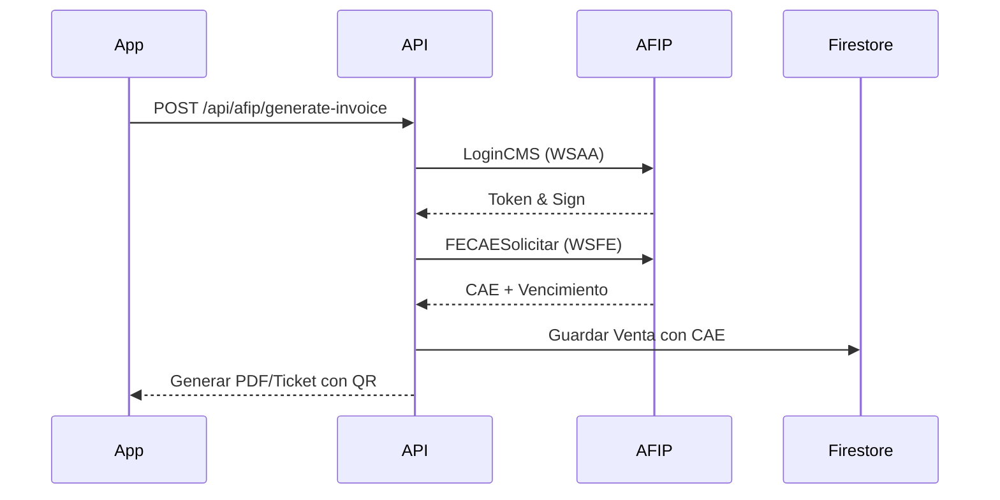

# Documentación Técnica Detallada - PedidosIA / Fiambrería Pro

Esta documentación proporciona una visión exhaustiva y técnica del sistema **PedidosIA**, un ecosistema diseñado para la gestión integral de negocios comerciales y gastronómicos en Argentina, con arquitectura SaaS multi-inquilino.

---

## 1. Arquitectura y Stack Tecnológico

### Arquitectura Base
El sistema utiliza una arquitectura **Serverless y Single-Page Application (SPA)** basada en:
*   **Framework**: Next.js 14 (App Router) para la capa de presentación y API routes.
*   **Base de Datos**: Google Firebase Firestore (NoSQL orientada a documentos).
*   **Autenticación**: Firebase Auth con JWT y perfiles personalizados.
*   **Estilos**: Tailwind CSS con un sistema de diseño basado en **Shadcn UI** para consistencia visual y accesibilidad.

### Diseño Multi-Inquilino (SaaS)
El aislamiento de datos se logra mediante una clave de "Inquilino" (`tenantId`) presente en cada documento de la base de datos.
*   **Contexto Global**: El Hook `useTenant` extrae el `tenantId` del token de sesión del usuario.
*   **Seguridad Nivel Datos**: Las `firestore.rules` prohíben el acceso a documentos cuyo `tenantId` no coincida con el del usuario autenticado.

---

## 2. Modelado de Datos (Firestore)

El sistema utiliza colecciones denormalizadas para optimizar la lectura. A continuación, las entidades críticas:

### Colección: `products`
| Atributo | Tipo | Descripción |
| :--- | :--- | :--- |
| `id` | String | Auto-generado por Firestore. |
| `tenantId` | String | ID del comercio al que pertenece. |
| `codigo_barras`| String | EAN-13 o SKU interno. |
| `es_pesable`| Boolean | Indica si el producto requiere balanza (uso de gramos). |
| `precio_venta`| Number | Precio por unidad o por kilogramo. |
| `stock_actual`| Number | Cantidad disponible en tiempo real. |

### Colección: `sales`
Almacena el historial de transacciones procesadas desde el POS.
*   **Cae**: Código de Autorización Electrónica devuelto por AFIP.
*   **Items**: Array de productos con sus subtotales en el momento de la venta.

---

## 3. Módulo de Punto de Venta (POS)

El POS está optimizado para periféricos externos (lectores de códigos de barras y balanzas).

### Lógica del Escáner (`ProductScanner.tsx`)
El sistema procesa dos tipos de códigos de barras:
1.  **Códigos EAN-13 Estándar**: Busca coincidencia exacta en la base de datos.
2.  **Códigos de Balanza (Prefijo 20)**:
    *   **Estructura**: `20 + SKU(5 dígitos) + VALOR(5 dígitos) + Dv`.
    *   **Procesamiento**: El sistema extrae el SKU para identificar el producto y el VALOR (que puede ser peso o precio según configuración de la balanza).
    *   **Cálculo Automático**: Si el código embebe PRECIO, el sistema calcula el peso: `(Precio Escaneado / Precio Unitario) * 1000`.

### Manejo de Artículos Pesables
Si un producto es marcado como `es_pesable` pero se escanea un código manual, el sistema dispara el componente `WeighableModal.tsx`, permitiendo al operador ingresar el peso manualmente o mediante interfaz táctil.

---

## 4. Integración Fiscal (AFIP)

Este módulo es una implementación compleja de los Web Services de AFIP para Argentina.

### Gestión de Certificados
El sistema no utiliza certificados genéricos. Cada comercio debe subir sus propios archivos:
*   **Archivos**: `.crt` (Certificado firmado por AFIP) y `.key` (Llave privada).
*   **Seguridad**: Se almacenan codificados en Firestore y solo se procesan por el servidor mediante `node-forge` para firmar los pedidos de sesión (Electronic Ticket).

### Flujo de Facturación


---

## 5. Gestión de Tesorería (Caja)

### Ciclo de Vida de la Caja (`RegisterOpenDialog.tsx` / `RegisterCloseDialog.tsx`)
1.  **Apertura**: Se registra un `monto_inicial` y el usuario responsable.
2.  **Operación**: Todas las ventas impactan automáticamente en las variables del documento de caja actual (`ventas_efectivo`, `ventas_mp`, etc.).
3.  **Arqueo**: Al cerrar, el sistema calcula el **Total Teórico**. El usuario ingresa el **Físico**, y el sistema reporta la `diferencia` (sobrante o faltante) de forma irreversible.

---

## 6. Sistema de Permisos y Roles (RBAC)

Se implementa una jerarquía basada en roles (`rol` en el perfil de usuario):

1.  **SuperAdmin**: Único con permiso para crear nuevos Comercios (Tenants), resetear configuraciones críticas y ver estadísticas globales.
2.  **Admin**: Control total sobre un negocio específico (Productos, AFIP, Usuarios, Backups).
3.  **Cajero (Cajero)**: Acceso restringido al POS, gestión de clientes y apertura/cierre de su propia caja. No puede ver reportes de ganancias ni editar precios.

---

## 7. Infraestructura y Seguridad

### Reglas de Firestore (`firestore.rules`)
```javascript
function isTenant(tenantId) {
  return request.auth != null && 
    get(/databases/$(database)/documents/users/$(request.auth.uid)).data.tenantId == tenantId;
}

match /products/{productId} {
  allow read: if isTenant(resource.data.tenantId);
  allow write: if isTenant(request.resource.data.tenantId);
}
```
Esto garantiza que aunque se conozca el ID de un producto de otro comercio, el servidor de base de datos denegará la conexión.

### Respaldos
El módulo de `backupUtils.ts` genera archivos en formato JSON con una suma de comprobación básica, permitiendo a los administradores exportar sus datos para auditoría externa o migración.

---
*Fin del Documento Técnico.*
